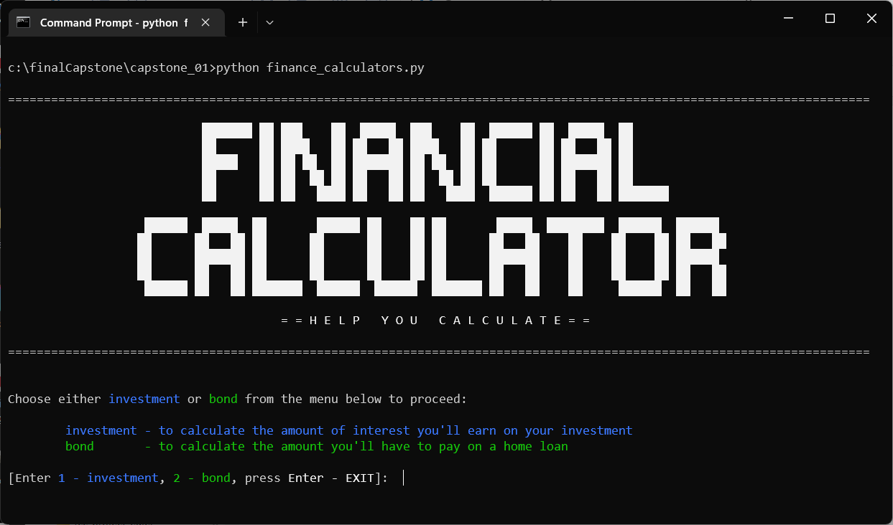

## DfE Software Engineering - Capstone Projects


| Name  | Descirption  |  Skills  | Completion Date  | Difficulty  |
|---|---|---|---|---|
| [Financial Calculator](#capstone-project-i-financial-calculator)  | Built a financial calculator that allows the user to access two different financial calculators: an investment calculator and a home loan repayment calculator.  | Python  | 6 December 2022  | :star::star:  |
| [Task Manager](#capstone-project-ii-task-manager)  | Built a task management tool for small businesses that allows users to log in, register new users, add tasks, and view a list of tasks.  | Python  | 12 December 2022  | :star::star::star:  |
| [Task Manager (Advanced)](#capstone-project-iii-task-manager-advanced)  | Built a task management tool for small businesses to manage tasks assigned to team members. This advanced version includes additional features such as the ability to generate reports and display statistics.  | Python  | 17 December 2022  | :star::star::star::star:  |
| [Inventory Management System](#capstone-project-iv-inventory-system)  | Built an inventory management tool for shoe warehouses that allows the user to perform various tasks related to managing the warehouse and its inventory.  | Python (OOP)  | 22 December 2022  |:star::star::star::star: |
| [Bookstore Management System](#capstone-v-bookstore-management-system)  | Built a bookstore management system that allows a clerk to manage the store's inventory by adding, updating, deleting, and searching for books in the database.   | Python, SQLite  | 28 December 2022  | :star::star::star::star::star:  |

--

## [Capstone Project I: Financial Calculator](#dfe-software-engineering---capstone-projects)

### Introduction
This project contains a program that allows the user to access two different financial calculators: an investment calculator and a home loan repayment calculator.



### Getting Started
These instructions will get you a copy of the project up and running on your local machine for development and testing purposes.

#### Prerequisites
You will need the following software to run the financial calculators:

- Python 3

#### Installation
To get started with the financial calculators, follow these steps:

1. Clone the repository:

```sh
git clone https://github.com/cwchan0212/finalCapstone.git
```

2. Navigate to the project directory:

```
cd finalCapstone/capstone_01/
```

3. Run the finance_calculator.py file:

```sh
python finance_calculator.py
```

### Using the Calculators

#### Investment Calculator 
The investment calculator allows the user to calculate the future value of their investment based on the initial principal, annual interest rate, and the number of years.
(Here is the generalised idea)

To use the investment calculator, follow the prompts in the command line interface (CLI).


```py
def investment_calculator():
      # Prompt the user for the amount of the deposit (i.e. the initial principal)
  deposit_amount = float(input("Please enter the AMOUNT OF MONEY that you deposit: ").strip())

  # Prompt the user for the annual interest rate
  interest_rate = float(input("Please enter the number of INTEREST RATE: ").strip())

  # Prompt the user for the number of years
  year = float(input("Please enter the number of YEAR(S) you plan on investing: ").strip())
  
  # Prompt the user for the type of interest
  interest_type = input("Please select the TYPE of interest (simple / compound): ").strip()

  # Calculate the future value based on the type of interest
  if interest_type == "simple":
      amount = round(deposit_amount *(1 + (interest_rate/100) * year), 2)
  elif interest_type == "compound":
      amount = round(deposit_amount * math.pow((1 + (interest_rate/100)), year), 2)

  # Print the result  
  print(f"\nThe total amount of principal and interest is R {amount} at {interest_type} interest rate of {interest_rate} % after {year} year(s) deposited.")
```


#### Home Loan Repayment Calculator
The home loan repayment calculator allows the user to calculate the monthly repayment amount based on the loan principal, interest rate, and loan term.
(Here is the generalised idea)

To use the home loan repayment calculator, follow the prompts in the CLI.

```py
ef home_loan_repayment_calculator():
  # Prompt the user for the present value of the house (i.e. loan principal)
  present_value_of_the_house = float(input("Please enter the PRESENT VALUE OF THE HOUSE: "))

  # Prompt the user for the interest rate
  interest_rate = float(input("Please enter the number of INTEREST RATE: "))

  # Prompt the user for the loan term (in months)
  number_of_months = int(input("Please enter the number of MONTH(S) you plan to take to repay the bond: "))

  # Calculate the monthly repayment amount
  amount = round(((interest_rate/100)/12) * present_value_of_the_house / (1 - math.pow((1 + ((interest_rate/100)/12)), (-number_of_months))), 2)

  # Print the result
  print(f"\nThe monthly repayment amount} is R {amount} at {interest_rate} %.")
```

---

## [Capstone Project II: Task Manager](#dfe-software-engineering---capstone-projects)

This program is a task management tool for small businesses. It allows users to log in, register new users, add tasks, and view a list of tasks.

### Getting Started
These instructions will get you a copy of the project up and running on your local machine for development and testing purposes.

### Prerequisites
You will need the following software to run the task manager:

- Python 3
- 
#### Installation
To get started with the task manager, follow these steps:

1. Clone the repository:

```sh
git clone https://github.com/cwchan0212/finalCapstone.git
```

2. Navigate to the project directory:

```
cd finalCapstone/capstone_02/
```

3. Run the task_manager.py file:

```sh
python task_manager.py
```


### Using the Task Manager
To use the task manager, follow the prompts in the command line interface (CLI).

#### Login
The user will be prompted to enter a username and password. A list of valid usernames and passwords is stored in the user.txt file. If the user enters an invalid username or password, an error message will be displayed and the user will be prompted to try again.

#### Menu
Once the user has successfully logged in, they will be presented with the following menu:

```
Please select one of the following options:

r - Register user (admin only)
a - Add task
va - View all tasks
vm - View my tasks
vs - View statistics (admin only)
e - Exit
```

- **Add Task:** The user will be prompted to enter the username of the person the task is assigned to, the title of the task, a description of the task, and the due date of the task. The task will be added to the tasks.txt file.
- **View Tasks:** The user can view a list of all tasks or filter the list to view only their tasks.
- **Register User:** Only the user with the username admin is allowed to register new users. The user will be prompted to enter a new username and password. The user will also be asked to confirm the password. If the value entered to confirm the password matches the value of the password, the username and password will be written to the user.txt file in the appropriate format.
- **Statistics:** The user with the username admin can view statistics about the tasks and users in the task manager. The total number of tasks and the total number of users will be displayed in a user-friendly manner.
- **Quit:** The user can exit the task manager program.

--

## [Capstone Project III: Task Manager (Advanced)](#dfe-software-engineering---capstone-projects)


### Using Task Manager (Advanced)

A program for small businesses to manage tasks assigned to team members. This advanced version includes additional features such as the ability to generate reports and display statistics.

### Getting Started
These instructions will get you a copy of the project up and running on your local machine for development and testing purposes.

### Prerequisites
You will need the following software to run the task manager:

- Python 3
- 
### Installation
To get started with the task manager, follow these steps:

1. Clone the repository:

```sh
git clone https://github.com/cwchan0212/finalCapstone.git
```

2. Navigate to the project directory:

```
cd finalCapstone/capstone_03/
```

3. Run the task_manager.py file:

```sh
python task_manager.py
```

### Usage
When the program starts, the user will be prompted to log in with a username and password. A list of valid usernames and passwords can be found in user.txt.
Once logged in, the user will be presented with a menu of options:
- **r**: register a new user (only available to the admin user)
- **a**: add a new task
- **va**: view all tasks
- **vm**: view tasks assigned to the logged-in user
- **gr**: generate reports
- **ds**: display statistics (only available to the admin user)
**e:** exit the program

Select an option by typing the corresponding letter and pressing enter.

#### Menu
Once the user has successfully logged in, they will be presented with the following menu:

```
Please select one of the following options:

r - register user (admin only)
a - add task
va - view all tasks
vm - view my tasks
ds - view statistics (admin only)
gr - generate reports
ds - display statistics
e - exit
```


#### Additional Features
- The **reg_user** function allows the admin user to register new users by prompting for a username and password.
- The **add_task** function allows any user to add a new task by prompting for the username of the - task assignee, the title, description, and due date.
- The **view_all** function allows any user to view all tasks listed in tasks.txt.
- The **gr** option generates two text files, task_overview.txt and user_overview.txt, which contain detailed information about the tasks and users in the system.
- The **ds** option displays statistics based on the data in task_overview.txt and user_overview.txt.

#### Known Issues
Some statistics may be inaccurate if tasks are deleted from tasks.txt.


-- 

## [Capstone Project IV: Inventory System](#dfe-software-engineering---capstone-projects)

### Description
This program is an inventory management tool for shoe warehouses. It allows the user to perform various tasks related to managing the warehouse and its inventory. It will read from the text file **inventory.txt**.

### Features
- Search products by code.
- Determine the product with the lowest quantity and restock it.
- Determine the product with the highest quantity.
- Calculate the total value of each stock item.

### Requirements
- Python 3
- tabulate (for formatting table output)


### Installation
To get started with the inventory system, follow these steps:

1. Clone the repository:

```sh
git clone https://github.com/cwchan0212/finalCapstone.git
```

2. Navigate to the project directory:

```
cd finalCapstone/capstone_04/
```

3. Run the inventory.py file:

```sh
python inventory.py
```


```sh
pip install tabulate
```


### Usage
To run the program, execute the **inventory.py** file. A menu will be displayed, allowing you to choose which task to perform. Follow the prompts to complete the task.

### File Structure
- **inventory.py**: Main program file containing the **Shoes** class and functions to perform various tasks.
- **inventory.txt**: A text file containing the data for the shoe warehouse.

### Class and Function Definitions

#### Shoes

- Attributes:
  - country: Country of origin for the shoes.
  - code: Unique code for the shoes.
  - product: Name of the shoe product.
  - cost: Cost of the shoes.
  - quantity: Quantity of the shoes in stock.

- Methods:
  - **get_cost()**: Returns the cost of the shoes.
  - **get_quantity()**: Returns the quantity of the shoes.
  - **__ str__()**: Returns a string representation of the shoes.
 
- Functions
  - **capture_shoes()**
This function allows a user to capture data about a shoe and create a shoe object, which is then added to the list of shoes.

  - **view_all()**
This function iterates over the list of shoes and prints the details of each shoe. Optionally, the details can be formatted as a table using Python's tabulate module.

  - **re_stock()**
This function finds the shoe with the lowest quantity and asks the user if they want to add more of this type of shoe to the warehouse. If the user confirms, the quantity is updated in the inventory.txt file and the list of shoes.

  - **search_shoe()**
This function searches for a shoe in the list using its code and returns the shoe object.

  - **value_per_item()**
This function calculates the total value for each item in the warehouse. The total value is calculated as the product of the cost and quantity of the shoes.

  - **highest_qty()**
This function determines the shoe with the highest quantity and prints it as being for sale.

-- 

## [Capstone V: Bookstore Management System](#dfe-software-engineering---capstone-projects)


### Description
This project is a program for a bookstore that allows a clerk to manage the store's inventory by adding, updating, deleting, and searching for books in the database. The program connects to an SQLite database called ebookstore and accesses a table called books, which stores information about the books in the store.

### Features
- Add new books to the database.
- Update book information.
- Delete books from the database.
- Search the database to find a specific book.

### Requirements
- Python 3
- SQLite
- tabulate (for formatting table output)

### Installation
To get started with the inventory system, follow these steps:

1. Clone the repository:

```sh
git clone https://github.com/cwchan0212/finalCapstone.git
```

2. Navigate to the project directory:

```
cd finalCapstone/capstone_05/
```

3. Run the bookstore.py file:

```sh
python bookstore.py
```


```sh
pip install tabulate
```


### Usage
To run the program, execute the **bookstore.py** file. A menu will be displayed, allowing you to choose which task to perform. Follow the prompts to complete the task.

### File Structure
- **bookstore.py**: Main program file containing functions to perform various tasks.

### Functions
- **add_book()**
This function allows the user to add a new book to the database by prompting for the book's information and inserting it into the books table.

- **update_book()**
This function allows the user to update the information for a book in the database by searching for the book using its id and prompting for the updated information.

- **delete_book()**
This function allows the user to delete a book from the database by searching for the book using its id and deleting it from the books table.

- **search_book()**
This function allows the user to search for a book in the database by specifying the search criteria (such as the title or author) and displaying the matching books.

###  Contributing
If you would like to contribute to this project, please follow the guidelines in the CONTRIBUTING.md file.

### License
This project is licensed under the terms of the MIT license. Please see the LICENSE file for more information.

### Acknowledgments
This project was inspired by HyperionDev. 
