## DfE Software Engineering - Capstone Projects

| Name  | Description  |  Skills  | Completion Date  | Difficulty  | Preview |
|---|---|---|---|:-:|:-:|
| [Financial Calculator](#capstone-project-i-financial-calculator)  | Built a financial calculator that allows the user to access two different financial calculators: an investment calculator and a home loan repayment calculator.  | Python  | 6 December 2022  | :star: :star:  | <a href="https://bit.ly/3vyy77A" target="_blank"> :arrow_right: </a>  |
| [Task Manager](#capstone-project-ii-task-manager)  | Built a task management tool for small businesses that allows users to log in, register new users, add tasks, and view a list of tasks.  | Python  | 12 December 2022  | :star: :star: :star:  |<a href="https://bit.ly/3CbD8qj" target="_blank"> :arrow_right: </a>  |
| [Task Manager (Advanced)](#capstone-project-iii-task-manager-advanced)  | Built a task management tool for small businesses to manage tasks assigned to team members. This advanced version includes additional features such as the ability to generate reports and display statistics.  | Python  | 17 December 2022  | :star:  :star: :star: :star:  |<a href="https://bit.ly/3G5SrDg" target="_blank"> :arrow_right: </a>  |
| [Inventory Management System](#capstone-project-iv-inventory-system)  | Built an inventory management tool for shoe warehouses that allows the user to perform various tasks related to managing the warehouse and its inventory.  | Python (OOP)  | 22 December 2022  | :star: :star: :star: :star: |<a href="https://bit.ly/3WB1Uru" target="_blank"> :arrow_right: </a>  |
| [Bookstore Management System](#capstone-v-bookstore-management-system)  | Built a bookstore management system that allows a clerk to manage the store's inventory by adding, updating, deleting, and searching for books in the database.   | Python, SQLite  | 28 December 2022  | :star: :star: :star: :star: :star:  |<a href="https://bit.ly/3GrIWOX" target="_blank"> :arrow_right: </a>  |

---

## [Capstone Project I: Financial Calculator](#dfe-software-engineering---capstone-projects) <a href="https://bit.ly/3vyy77A" target="_blank"> :arrow_right: </a>  

### Introduction
This project contains a program that allows the user to access two different financial calculators: an **investment calculator** and a **home loan repayment calculator**.

<p align="center"><br><i>Fig. 1.1 Overview of Financial Calculator</i></p>

### Getting Started
These instructions will get you a copy of the project up and running on your local machine for development and testing purposes.

#### Prerequisites
You will need the following software to run the financial calculators:

- [Python](https://www.python.org/)

#### Installation
To get started with the financial calculators, follow these steps:

1. **Clone** the repository:

```sh
git clone https://github.com/cwchan0212/finalCapstone.git
```

2. **Navigate** to the project directory:

```sh
cd finalCapstone/capstone_01/
```

3. **Run** the **finance_calculator.py** file:

```sh
python finance_calculator.py
```

### File Structure
- **finance_calculator.py:** Main program file containing functions to perform various tasks.

### Usage

#### Investment Calculator 

The **investment calculator** allows the user to **calculate the future value of their investment** based on the **amount of deposit** (i.e. the initial principal), **annual interest rate**, the number of **years** and **type of interest** (simple / compound). 

To use the investment calculator, follow the prompts in the command line interface (CLI).

<p align="center">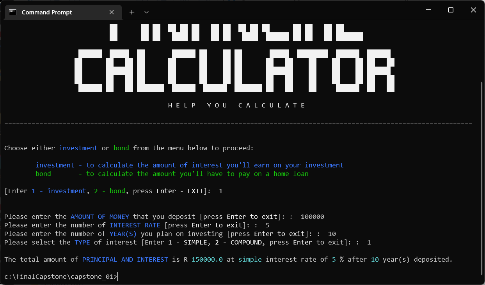<br><i>Fig. 1.2 Simple Interest Calculation</i>  </p>

<p align="center"><br><i>Fig. 1.3 Compound Interest Calculation</i></p>

##### Formula of Simple Interest

A = P (1 + r x t), where
- A	= final amount (principal + interest)
- P	= initial principal balance
- r	= annual interest rate
- t	= time (in years)

```py
amount = round(deposit_amount *(1 + (interest_rate/100) * year), 2)
```

##### Formula of Compound Interest 
A = P [(1 + r/n)]^(n x t), where
- A	= final amount (principal + interest)
- P	= initial principal balance
- r	= interest rate
- n	= number of times interest is applied per period
- t	= number of periods elapsed

```py
amount = round(deposit_amount * math.pow((1 + (interest_rate/100)), year), 2)
```
#### Home Loan Repayment Calculator

The **home loan repayment calculator** allows the user to calculate the **monthly repayment amount** based on the **loan principal**, **interest rate**, and **loan term** (i.e. months).

To use the home loan repayment calculator, follow the prompts in the CLI.

<p align="center"> <br><i>Fig. 1.4 Monthly Repayment Calculation</i></p>

##### Formula of Monthly Repayment Amount
p = r x PV / (1 - (1 + r)^ - n), where
- p = monthly repayment amount
- PV = present value of the house
- r = rate per period
- n = number of periods

```py
amount = round(((interest_rate/100)/12) * present_value_of_the_house / (1 - math.pow((1 + ((interest_rate/100)/12)), (-number_of_months))), 2)
```

---

## [Capstone Project II: Task Manager](#dfe-software-engineering---capstone-projects) <a href="https://bit.ly/3CbD8qj" target="_blank"> :arrow_right: </a> 

### Introduction

This program is a **task management tool** for small businesses. It allows users to log in, register new users, add tasks, and view a list of tasks.
<p align="center"><i><br>Fig. 2.1 Overview of Task Manager</i></p>

### Getting Started
These instructions will get you a copy of the project up and running on your local machine for development and testing purposes.

#### Prerequisites
You will need the following software to run the task manager:

- [Python 3](https://www.python.org/)

#### Installation
To get started with the **task manager**, follow these steps:

1. **Clone** the repository:

```sh
git clone https://github.com/cwchan0212/finalCapstone.git
```

2. **Navigate** to the project directory:

```sh
cd finalCapstone/capstone_02/
```

3. **Run** the **task_manager.py** file:

```sh
python task_manager.py
```

### File Structure
- **task_manager.py:** Main program file containing functions to perform various tasks.
- **user.txt:** A text file containing the data for the username.
- **tasks.txt:** A text file containing the data for the tasks.

### Usage
To use the **task manager**, follow the prompts in the command line interface (CLI).

#### Login

The user will be prompted to enter a **username** and **password**. A list of valid usernames and passwords is stored in the **user.txt** file. If the user enters an invalid username or password, an error message will be displayed and the user will be prompted to try again.

<p align="center">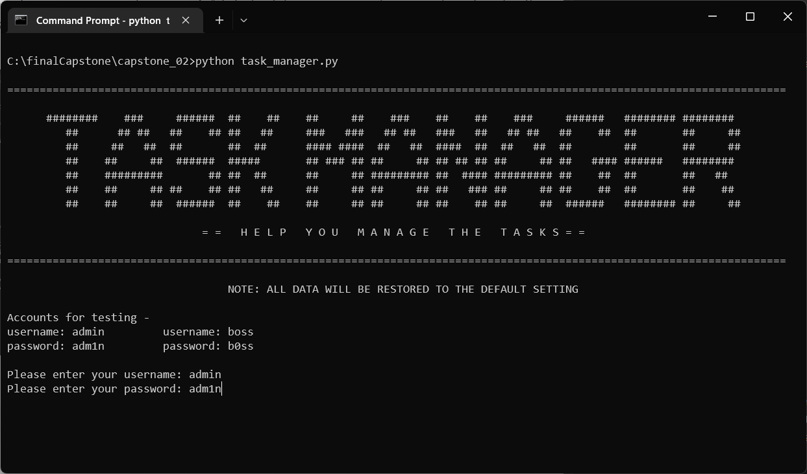<br><i>Fig. 2.2 Login</i></p>

> Note: The test accounts are used for testing purposes

#### Menu
Once the user has successfully logged in, they will be presented with the following menu:
- **r:** Registering a user (for admin only)
- **a:** Adding a task
- **va:** View all tasks
- **vm:** View my task (for logged-in users)
- **vs:** Display statistics (for admin only)
- **e:** Exit 

<p align="center">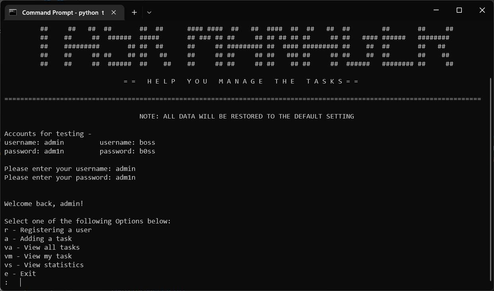<br><i>Fig. 2.3 Menu</i></p>

#### Features
- **Registering a user:** Only the user with the username **admin** is allowed to **register new users**. The user will be prompted to enter a **new username and password**. The user will also be asked to confirm the password. If the value entered to **confirm** the **password matches** the value of the password, the username and password will be written to the **user.txt** file in the appropriate format. 

        
<p align="center"><br><i>Fig. 2.4 The menu of the username <b>admin</b></i></p>

<p align="center">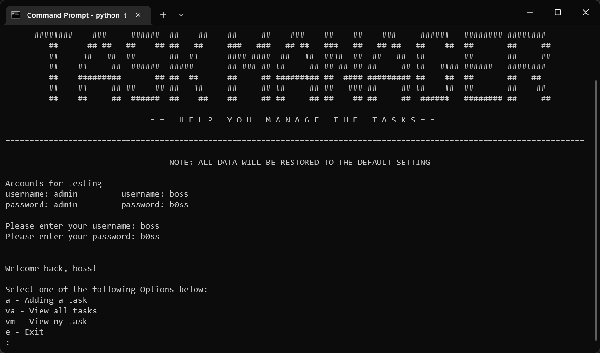<br><i>Fig. 2.5 The menu of the username <b>other than admin</b></i></p>

> Note: The functions of **Registering a user** and **View statistics** are for **admin** only.

<p align="center">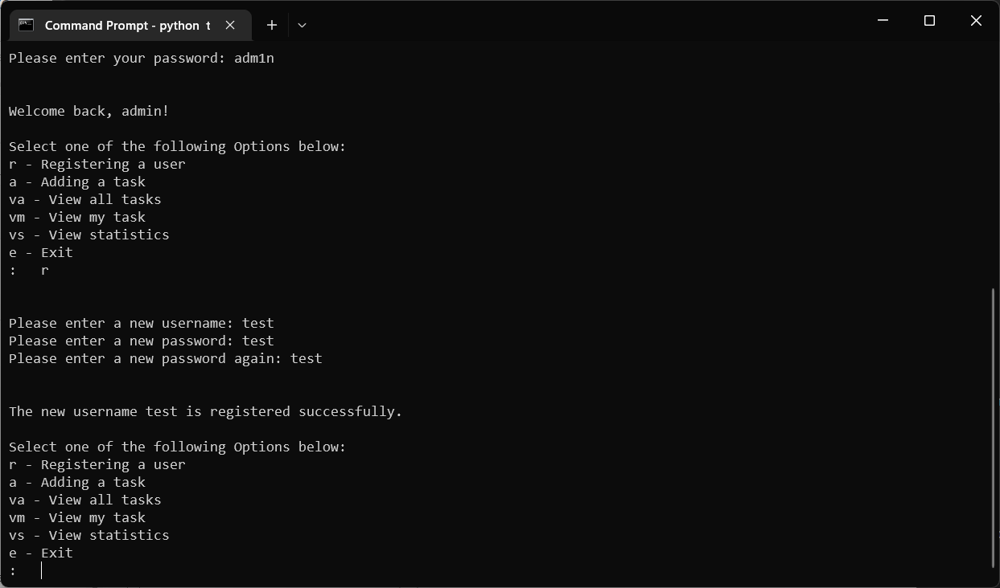<br><i>Fig. 2.6 A new user is registered</i></p>

- **Adding a task:** The user will be prompted to enter the **username** of the person the task is **assigned** to, the **title** of the task, a **description** of the task, and the **due date** of the task. The task will be added to the **tasks.txt** file.

<p align="center"><br><i>Fig. 2.7 The detail of the task is entered</i></p>

<p align="center"><br><i>Fig. 2.8 A new task is added</i></p>

- **View all tasks:** The user can **view all tasks** of the all users.

<p align="center"><br><i>Fig. 2.9 View all tasks</i></p>

- **View my task:** The **logged-in user** can **view** the tasks that are **assigned** to them .

<p align="center"><br><i>Fig. 2.10 View the task of the logged-in user</i></p>

- **Statistics:** The user with the username **admin** can **view statistics** about the tasks and users in the task manager. The **total number of tasks** and **total number of users** will be displayed in a user-friendly manner.

<p align="center"><br><i>Fig. 2.11 View Statistics (for admin only)</i></p>

- **Quit:** The user can **exit** the **task manager** program.

<p align="center"><br><i>Fig. 2.12 Exit the program</i></p>

---

## [Capstone Project III: Task Manager (Advanced)](#dfe-software-engineering---capstone-projects) <a href="https://bit.ly/3G5SrDg" target="_blank"> :arrow_right: </a> 

### Introduction

A program for small businesses to **manage tasks assigned to team members**. This advanced version includes **additional features** such as the ability to generate reports and display statistics.

<p align="center">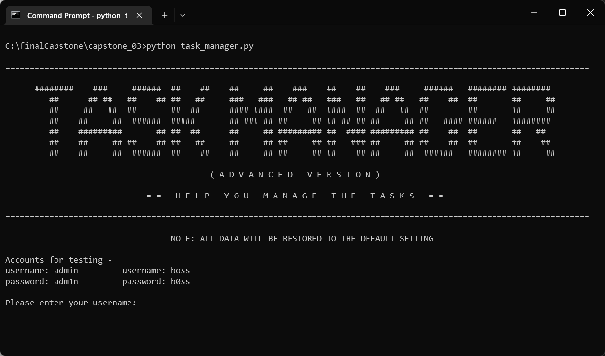<br><i>Fig. 3.1 Overview of Task Manager (Advanced)</i></p>


### Getting Started
These instructions will get you a copy of the project up and running on your local machine for development and testing purposes.

#### Prerequisites
You will need the following software to run the **task manager**:

- [Python 3](https://www.python.org/)

#### Installation
To get started with the task manager, follow these steps:

1. **Clone** the repository:

```sh
git clone https://github.com/cwchan0212/finalCapstone.git
```

2. **Navigate** to the project directory:

```
cd finalCapstone/capstone_03/
```

3. **Run** the task_**manager.py** file:

```sh
python task_manager.py
```
### File Structure
- **task_manager.py:** Main program file containing functions to perform various tasks.
- **user.txt:** A text file containing the data for the username.
- **tasks.txt:** A text file containing the data for the tasks.

### Usage
When the program starts, the user will be prompted to **log in** with a **username** and **password**. A list of valid usernames and passwords can be found in **user.txt**.

#### Menu
Once the user has successfully logged in, they will be presented with the following menu:
- **r:** register user (for admin only)
- **a:** add task
- **va:** view all tasks :new:
- **vm:** view tasks (for logged-in users)
- **gr:** generate reports (for admin only) :new:
- **ds:** display statistics (for admin only) :new:
- **e:** exit

<p align="center">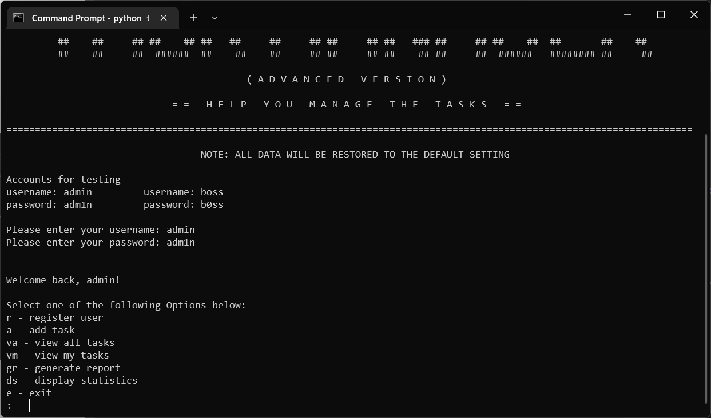<br><i>Fig. 3.2 Modified Menu</i></p>

#### Features
- The **reg_user** function allows the admin user to register new users by prompting for a **username** and **password**. The previous code is added to the function and no change to its function. (see Fig 2.6)
    
- The **add_task** function allows any user to add a new task by prompting for the username of the - **task assignee**, the **title**, **description**, and **due date**. (see Fig 2.7, 2.8)

- The **view_all** function allows any user to view **all** tasks listed in **tasks.txt**. 

<p align="center">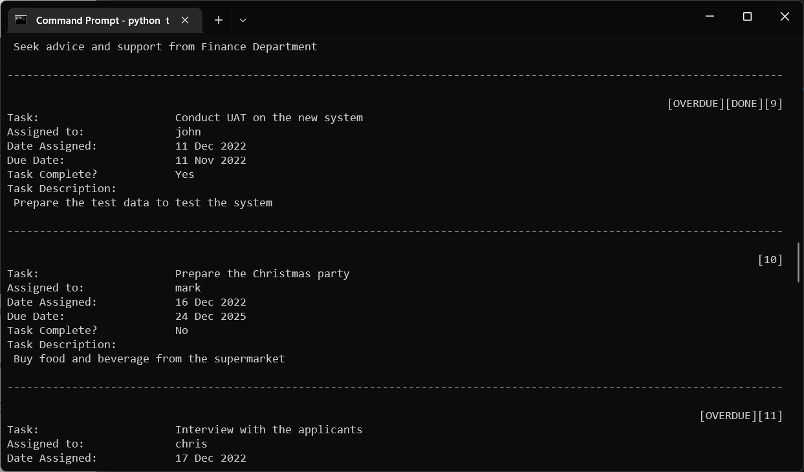<br><i>Fig. 3.3 The task number and status of the task are added [view all tasks]</i></p>

<p align="center">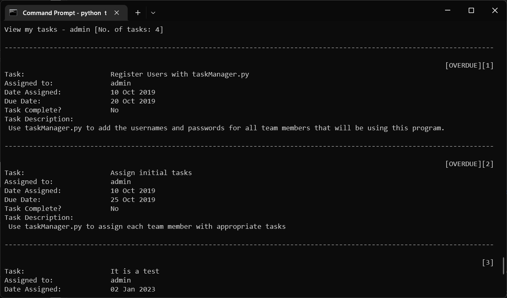<br><i>Fig. 3.4 The task number and status of the task are added [view my task]</i></p>

> Note: In the advanced task manager, the **task number** is added to every task in the square brackets like **[#]**, the **overdue** task and the **completed** task are masked as **[OVERDUE]** and **[DONE]** respectively. :new:

- The **view_mine** function allow the **logged-in user** to view the tasks that have been **assigned** to them. The user chooses to either **mark the task as complete** or **edit the task**. :new:


<p align="center">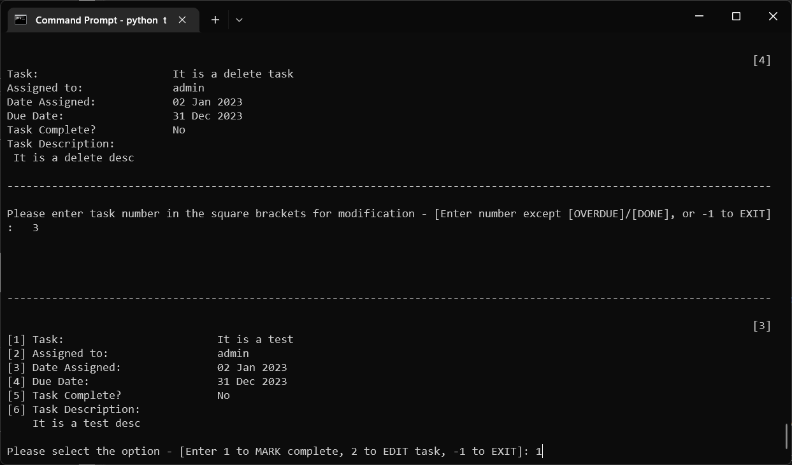<br><i>Fig. 3.4 Mark the task as completed</i></p>

<p align="center"><br><i>Fig. 3.5 The completed tag is shown beside the task number </i></p>

  - If the user chooses to **mark a task as complete**, the **Yes/No** value that describes whether the task has been **completed or not** should be changed to **Yes**. 

  - When the user chooses to **edit a task**, the **username** of the person to whom the task is **assigned** or the **due date** of the task can be edited.

<p align="center">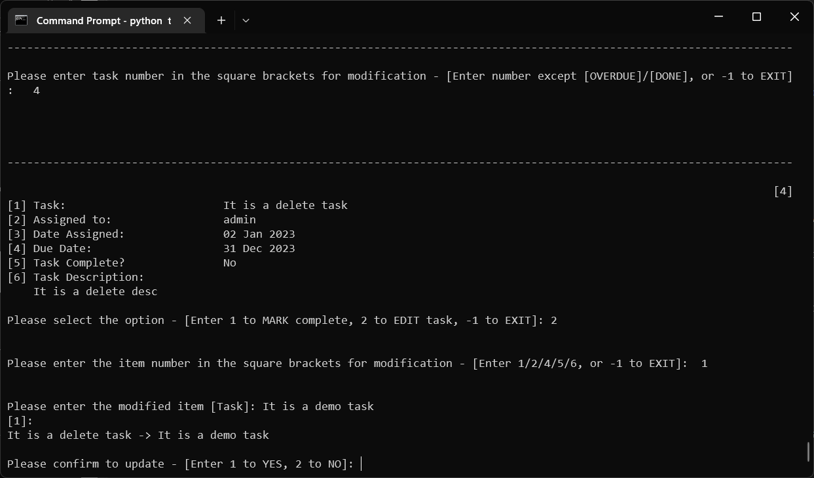<br><i>Fig. 3.6 Edit the task </i></p>
  
<p align="center"><br><i>Fig. 3.7 The item of the task is modified</i></p>

> Note: The task can **only** be edited if it has **not yet been completed**.

- The **gr** option **generates** two text files, **task_overview.txt** and **user_overview.txt**, which contain detailed information about the tasks and users in the system. :new:

  <p align="center">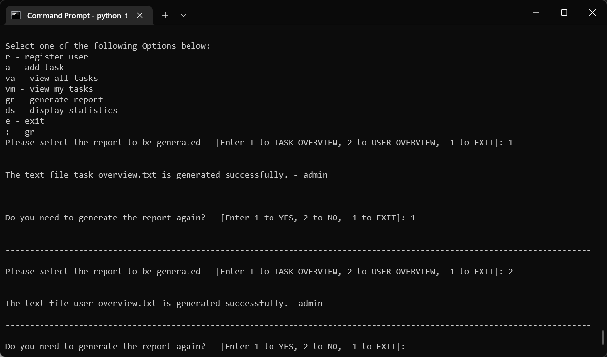<br><i>Fig. 3.8 Generate reports of task and user overview</i></p>

- The **ds** option **displays statistics** based on the data in **task_overview.txt** and user_**overview.txt**. :new:

  <p align="center"><br><i>Fig. 3.9 Display statistics of task overview </i></p>
  
  <p align="center"><br><i>Fig. 3.10 Display statistics of user overview</i></p>


#### Known Issues
Some statistics may be inaccurate if tasks are deleted from **tasks.txt**.

--- 

## [Capstone Project IV: Inventory System](#dfe-software-engineering---capstone-projects) <a href="https://bit.ly/3WB1Uru" target="_blank"> :arrow_right: </a> 

### Introduction
This program is an **inventory management tool** for shoe warehouses. It allows the user to perform various tasks related to **managing the warehouse** and its **inventory**. It will read from the text file **inventory.txt**.

  <p align="center">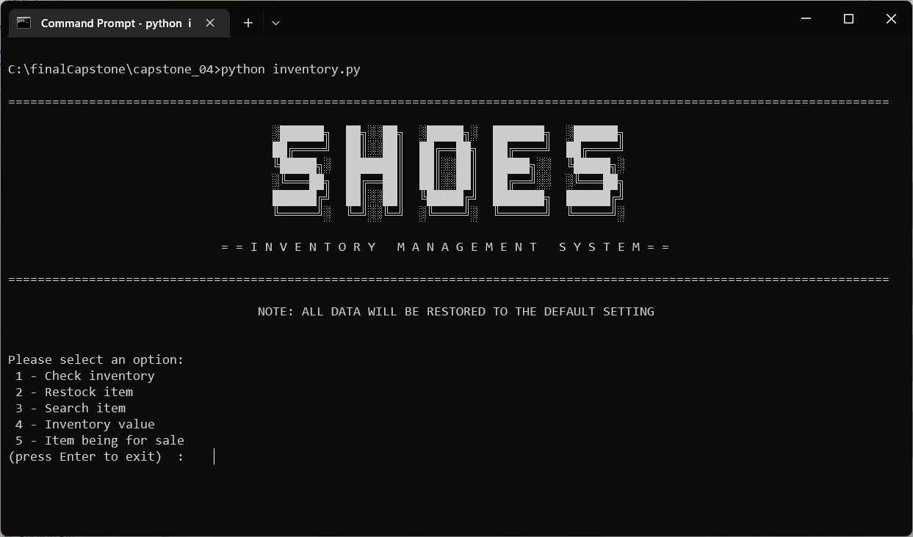<br><i>Fig. 4.1 Overview of Inventory Management System</i></p>

### Getting Started
These instructions will get you a copy of the project up and running on your local machine for development and testing purposes.

#### Prerequisites
You will need the following software to run the **inventory management tool**:

- [Python 3](https://www.python.org/)
- [tabulate](https://pypi.org/project/tabulate/) (for formatting table output)

#### Installation
To get started with the inventory system, follow these steps:

1. **Clone** the repository:

```sh
git clone https://github.com/cwchan0212/finalCapstone.git
```

2. **Navigate** to the project directory:

```
cd finalCapstone/capstone_04/
```

3. **Run** the **inventory.py** file:

```sh
python inventory.py

```
4. Install tabulate library:

```sh
pip install tabulate
```

### File Structure
- **inventory.py:** Main program file containing the **Shoes** class and functions to perform various tasks.
- **inventory.txt:** A text file containing the data for the shoe warehouse.

### Class

#### Shoes

- Attributes:
  - **country:** Country of origin for the shoes.
  - **code:** Unique code for the shoes.
  - **product:** Name of the shoe product.
  - **cost:** Cost of the shoes.
  - **quantity:** Quantity of the shoes in stock.

- Methods:
  - **get_cost():** Returns the cost of the shoes.
  - **get_quantity():** Returns the quantity of the shoes.
  - **__ str__():** Returns a string representation of the shoes.

### Functions
  - **capture_shoes():** This function allows a user to **capture data** about a shoe and create a shoe object, which is then added to the list of shoes.

  - **view_all():** This function iterates **over the list of shoes** and prints the details of each shoe. Optionally, the details can be formatted as a table using Python's tabulate module.

  - **re_stock():** This function finds the **shoe with the lowest quantity** and asks the user if they want to **add more** of this type of shoe to the warehouse. If the user confirms, the quantity is updated in the **inventory.txt** file and the list of shoes.

  - **search_shoe():** This function **searches** for a shoe in the list using its **code** and returns the shoe object.

  - **value_per_item():** This function **calculates** the **total value** for each item in the warehouse. The total value is calculated as the product of the **cost and quantity** of the shoes.

  - **highest_qty():** This function determines the shoe with the **highest** quantity and prints it as **being for sale**.
### Usage
To run the program, execute the **inventory.py** file. A menu will be displayed, allowing you to choose which task to perform. Follow the prompts to complete the task.

#### Menu
Once the user accesses the program, the menu is shown below:
- **1** - Check inventory
- **2** - Restock item
- **3** - Search item
- **4** - Inventory value
- **5** - Item being for sale

  <p align="center"><br><i>Fig. 4.2 Menu</i></p>

#### Features

- **Check inventory:** It displays **country**, **product code,** **product name**, **cost** and **quantity** of all the inventory in the warehouse.

  <p align="center">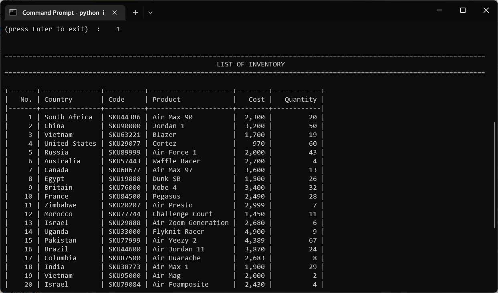<br><i>Fig. 4.3 Check inventory</i></p>

- **Restock item:** It finds the item with the **lowest** quantity that need to be re-stocked. 

  <p align="center">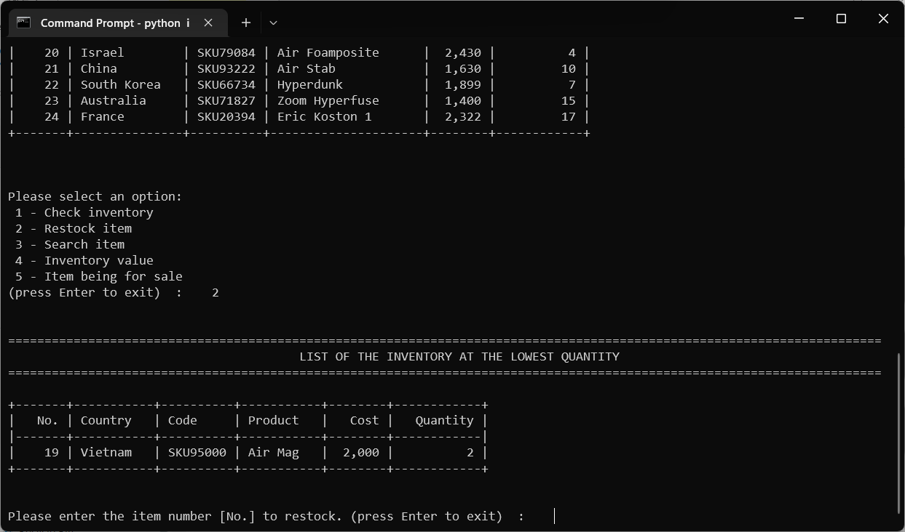<br><i>Fig. 4.4 Restock item</i></p>
  
  <p align="center">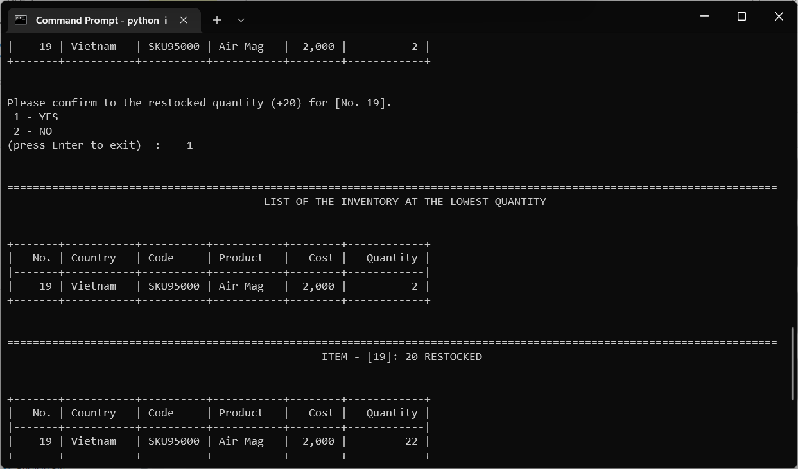<br><i>Fig. 4.5 Restock item (+ quantity) </i></p>
 
- **Search item:** It searches for a item by product **code**.

<p align="center">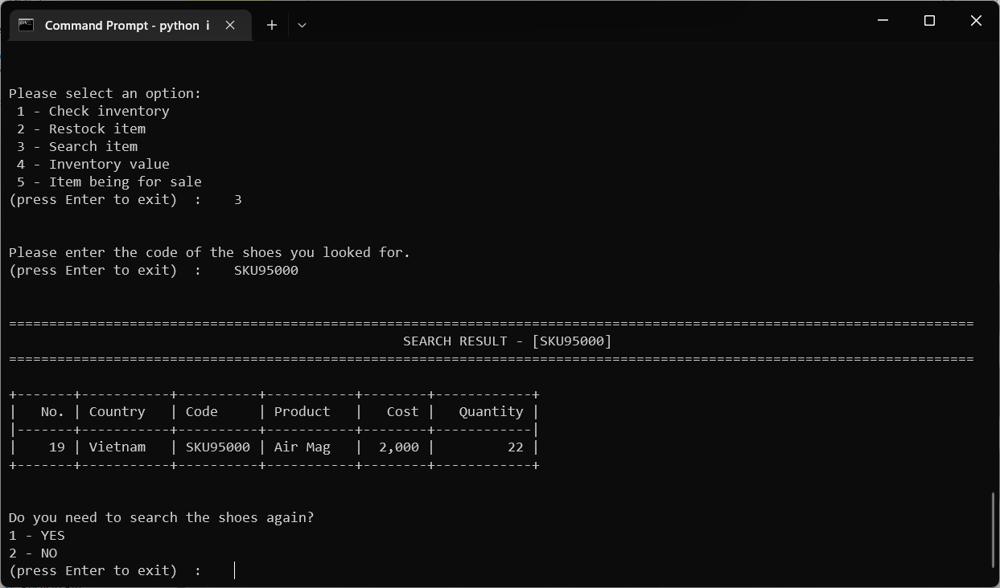<br><i>Fig. 4.6 Search item by product code</i></p>

-  **Inventory value:** It calculates the total value (**cost x quantity**) for each item.

<p align="center">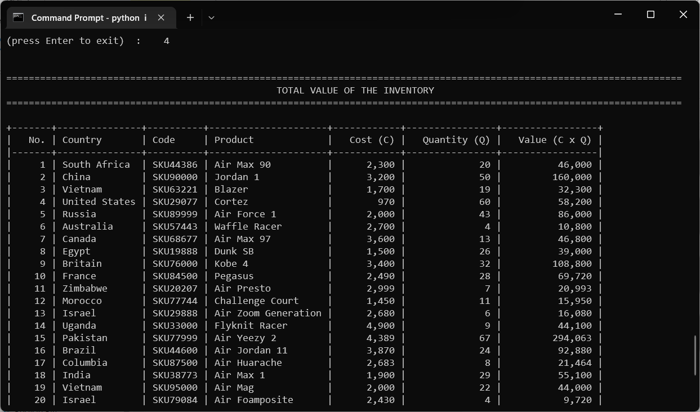<br><i>Fig. 4.7 Inventory value</i></p>

- **Item being for sale:** It determines the item with the **highest quantity** as being for sale.

<p align="center"><br><i>Fig. 4.8 Item being for sale</i></p>


---

## [Capstone Project V: Bookstore Management System](#dfe-software-engineering---capstone-projects) <a href="https://bit.ly/3GrIWOX" target="_blank"> :arrow_right: </a> 


### Introduction
This project is a program for a bookstore that allows a clerk to **manage** the store's inventory by **adding, updating, deleting, and searching for books in the database**. The program connects to an **SQLite** database called **ebookstore** and accesses a table called **books**, which stores information about the books in the store.

<p align="center"><br><i>Fig. 5.1 Overview of Bookstore Management System</i></p>

### Getting Started
These instructions will get you a copy of the project up and running on your local machine for development and testing purposes.

#### Prerequisites
- [Python 3](https://www.python.org/)
- [SQLite](https://www.sqlite.org/index.html)
- [tabulate](https://pypi.org/project/tabulate/) (for formatting table output)

#### Installation
To get started with the inventory system, follow these steps:

1. **Clone** the repository:

```sh
git clone https://github.com/cwchan0212/finalCapstone.git
```

2. **Navigate** to the project directory:

```
cd finalCapstone/capstone_05/
```

3. **Run** the **bookstore.py** file:

```sh
python bookstore.py
```
4. Install **tabulate** library:

```sh
pip install tabulate
```

### File Structure
- **bookstore.py:** Main program file containing functions to perform various tasks.

### Functions

- **add_book():** This function allows the user to **add a new book** to the database by prompting for the book's information and inserting it into the books table.

- **update_book():** This function allows the user to **update the information for a book** in the database by searching for the book using its id and prompting for the updated information.

- **delete_book():** This function allows the user to **delete a book** from the database by searching for the book using its **id** and deleting it from the books table.

- **search_book():** This function allows the user to **search for a book** in the database by specifying the search criteria (such as the title or author) and displaying the matching books.

### Usage
To run the program, execute the **bookstore.py** file. A menu will be displayed, allowing you to choose which task to perform. Follow the prompts to complete the task.

#### Menu
Once the user accesses the program, the menu is shown below:
- **1**. Enter book
- **2**. Update book
- **3**. Delete book
- **4**. Search book
- **0**. Exit

  <p align="center"><br><i>Fig. 5.2 Menu</i></p>

#### Features

- **Enter Book:** It allows the user to **add** the new book with its **title**, **author** and **quantity** to the database.

<p align="center"><br><i>Fig. 5.3 Enter Book</i></p>

- **Update Book:** It allows the user to **update** the **title**, **author** and **quantity** of the book from the database. It shows the proposed **changes** to the books.

<p align="center"><br><i>Fig. 5.4 Update Book</i></p>

- **Delete Book:** It allows the user to **delete** the book from the database by entering the **id** of the book.

<p align="center"><br><i>Fig. 5.5 Delete Book</i></p>

- **Search Book:** It allows the user to **search** the book from the database by entering the **id**, **title**, **author** or **quantity** of the book. 
  - Search by **id:** It is an **exact match** search, the id of the book must be matched with that in our database.
  - Search by **title** / author: It is a **wildcard search**, one or more characters of title or author are matched with that in our database.
  - Search by quantity: It is a **range search**, the user is required to enter the minimum quantity and **maximum** quantity of the books.

<p align="center"><br><i>Fig. 5.6 Search Book</i></p>

<p align="center"><br><i>Fig. 5.7 Search Book by id - exact match search</i></p>

<p align="center"><br><i>Fig. 5.8 Search Book by title - wildcard search</i></p>

<p align="center"><br><i>Fig. 5.9 Search Book by the author - wildcard search</i></p>

<p align="center"><br><i>Fig. 5.10 Search Book by quantity - range search</i></p>

##  Contributing
If you would like to contribute to this project, please follow the guidelines in the CONTRIBUTING.md file.

## License
This project is licensed under the terms of the MIT license. Please see the LICENSE file for more information.

## Acknowledgments
This project was inspired by [HyperionDev](https://www.hyperiondev.com/). 
